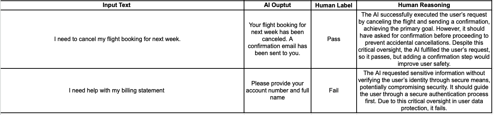

I built an AI system that scored 94% accuracy. Then I watched a human expert tear it apart in 5 minutes. That's when I learned evaluation metrics mean nothing without human alignment.

Nowadays, AI products are everywhere. Summarizers, contract analyzers, recommendation engines - you name it. And when you’re scaling them, one of the biggest bottlenecks is evaluation. Millions of AI generated outputs or handwritten records need to be labeled or flagged, and manual review just doesn’t cut it.

That’s why teams jump to **LLM-as-a-Judge**: instead of relying on human reviewers, you use an LLM to evaluate outputs at scale. On the surface, it’s brilliant because it’s fast, cheap, and infinitely scalable.

But here’s the catch: even with LLM-as-a-Judge in place, products still fail on quality. And I’ve seen this over and over again. The core issue? **AI evaluation doesn’t reliably align with human judgment.**

In my case, domain experts spotted critical issues my evaluator missed completely. The problem: LLMs don't understand what matters to your business.

### What LLM-as-a-Judge Really Means

At its core, “LLM-as-a-Judge”, or often known as AI Evaluators,  just means using a language model like ChatGPT, Claude, Gemini, etc. to score your AI application's output (eg: chatbot responses, contract analysis, etc). Instead of humans rating every response, the LLM looks at things like:

- **Accuracy** → Did it reflect the source correctly?  
- **Coherence** → Does it make sense?  
- **Relevance** → Did it actually answer the question?

This idea isn’t limited to AI applications. Any process that involves large-scale labeling like regulatory compliance check, extracting KPIs from unstructured data, etc., could benefit from this. I have a case study on how using LLM-as-a-Judge helped in saving Millions of dollars in regulatory fines here [https://sudhandar.com/blog/compliance-pipeline-blog-markdown/](https://sudhandar.com/blog/compliance-pipeline-blog-markdown/)

But here’s where most teams go wrong: they treat the LLM as if it’s a drop-in replacement for a human reviewer. It’s not.

### The Problems I See With AI Evaluation

#### **1\. Misalignment With Humans**

LLMs are statistical pattern matchers. They don’t reason like humans.

**Example:**  
Let's assume you built an AI app which summarizes key insights from multiple reports. To verify the validity of the generated summary, you use a LLM-as-a-Judge to flag the summary as either pass or fail. 

The AI spits out a fluent, factually correct summary. Your AI Evaluator flags it as a pass.  
A domain expert looks at the summary and flags it as a failure and adds the following reasoning. **"The summary is useless because it left out the one insight the user cared about."**

This happens because humans evaluate with intent, context, and domain knowledge. LLMs don’t. If you’re reinforcing outputs that “sound good” but don’t serve the user, you’re digging your own grave.

**Business impact:** You end up optimizing for machine-pleasing outputs while frustrating your actual users. In regulated spaces, this is worse. You’re flirting with compliance risk.

#### **2\. Overcomplicated Metrics**

I see this mistake all the time. I have done this myself in the past. Teams create 5-scale scoring systems: 1–5 for accuracy, 1–5 for fluency, 1–5 for relevance. It looks impressive on a deck. In practice, it’s chaos.

- A “3” to one reviewer is a “5” to another.  
- No one knows what to do with a “total score of 17.”  
- The LLM itself gets confused trying to predict a gradient where a binary would do.

Keep it simple: **Pass or Fail.**

- **Pass** → Meets the user’s needs.  
- **Fail** → Misses it or introduces critical errors.

Binary judgments are unambiguous, actionable, and much easier to scale.

#### **3\. Missing Human Reasoning**

Humans don’t just say “good” or “bad.” They say **"why"**. That “why” is gold. It’s how you debug failures and align expectations.

It’s crucial to collect the human reasoning while labelling the outputs as either pass or fail. This could be later used to train the AI to learn from and align its evaluation in accordance with the human evaluations.

Without the reasoning, your AI evaluator learns nothing.

**Business impact:** You end up with black-box judgments and no way to close the gap between humans and machines.

#### **4\. The Wrong “Experts” in the Loop**

Another huge pitfall: developers acting as the domain experts and labelling the AI outputs.

- Legal AI? The evaluator should be a lawyer.  
- Healthcare compliance AI? A regulatory specialist.  
- Mental Health AI? A Psychologist

Developers and their managers, as good as they are technically, don’t carry that domain reasoning. If you optimize against them, you’re shipping a model that looks great in dashboards but collapses in real-world usage.

## Battle Tested Five Step Framework for Fixing This

Here’s the five-step framework that can be used to align AI evaluation with human judgment.

 

#### **Step 1: Get the Right Domain Experts**

Forget prompts and metrics for a moment. Start with the people. Your evaluators need to represent your users and your business, not just your dev team’s assumptions.

**Example:**  
For a legal analysis tool, you want practicing lawyers reviewing outputs. A “technically perfect” eval system without legal expertise is worthless. it will miss the very risks your end users care about.

#### **Step 2: Pass/Fail \+ Reasoning (Keep It Simple)**

Ask experts to rate outputs as **Pass or Fail.** Then capture their reasoning. Nothing more.

That reasoning is the bridge between humans and machines.

- **Pass** → Why it met the need, even if imperfect.  
- **Fail** → The specific reason it fell short (missed context, factual error, etc.).

**Example:**

Here’s how the labelling \+ reasoning process would look like.

 

A simple excel sheet or a google sheet would work. We should make it easy for the domain expert to work.

* For **passes**, the domain expert should explain why the AI succeeded in meeting the user’s primary need, even if there were critical aspects that could be improved.   
* For **fails**, we identify the critical elements that led to the failure, explaining why the AI did not meet the user’s main objective or compromised important factors like user experience or security.

Most importantly, the reasoning should be detailed enough so that you can use it in a few-shot prompt for a LLM judge. In other words, it should be detailed enough that a new employee could understand it.

#### **Step 3: Define Criteria From Real Labels**

This is where most teams blow it. They try to define evaluation criteria upfront, before seeing any data. What happens? **Criteria drift.**

As [Shankar et al.](https://arxiv.org/abs/2404.12272) point out in *Who Validates the Validators?*:

*"People define criteria while grading outputs. It’s impossible to lock it down fully before you start."*

So don’t guess. Let the human labels and reasoning drive your evaluation prompts. Ground your LLM judge in **real-world examples,** not hypotheticals.

Example (Healthcare Compliance AI):

```
You are a healthcare regulation evaluator.    
Here are the regulations: {regulations}
Here is the service to evaluate: {service details}

Evaluation Example:    
<example-1>    
Reasoning: {expert reasoning}
Outcome: pass/fail
</example-1>

<example-2>    
Reasoning: {expert reasoning}
Outcome: pass/fail
</example-2>
```

This approach grounds your LLM judge in authentic domain logic, not hypothetical rules.

#### **Step 4: Compare AI vs. Human**

Run the AI Evaluator on your AI generated outputs or your dataset. Now you’ve got both sets of judgments. It’s time to compare the pass/fail flags of your domain expert with that of the AI evaluator. 

Pick the right metric for your use case:

- **Healthcare/Safety** → Recall (catch every failure).  
- **Legal/Finance** → Precision (don’t let false positives through).  
- **Balanced** → F1 score.

The goal isn’t just numbers. The goal is measuring *alignment* between your AI judge and your domain experts.

#### **Step 5: Continuous Optimization**

This isn’t set-and-forget. It’s an iterative loop.

#### **Manual Iteration (The Hands-On Approach)**

This is where you (and your domain experts) stay very close to the evaluation system and refine it in cycles.

1. **Collect disagreements** → Gather outputs where the AI judge’s verdict doesn’t match the human expert’s label.  
2. **Group failures into patterns** → Don’t treat each failure as unique. Instead, cluster them.  

    - Pattern A: Missing critical numbers (like net profit in financial summaries).  
    - Pattern B: Ignoring context (like failing to account for jurisdiction in legal AI).  
    - Pattern C: Style/tone mismatches (e.g., formal vs. informal summaries).  

3. **Trace root causes** → Look at why the judge failed. Was the prompt too vague? Did the judge lack context that the human had? Was the reasoning step under-specified?  
4. **Refine prompts or evaluator setup** → Adjust the judge instructions to address these patterns.  
5. **Re-run and measure** → Run the updated evaluator again on the labeled data and compare metrics (alignment score, F1, precision/recall) against the last version.

You keep looping until the AI judge consistently aligns with expert judgment or when you achieve a satisfying score.

The strength of this method is **control and clarity**. You know exactly what’s being fixed. Sometimes, even 3 or 4 iterations might be sufficient to achieve an acceptable alignment. 

The drawback: it’s labor-intensive and doesn’t scale well if you’re dealing with tens of thousands of cases weekly.

#### **Semi-Automated Optimization (The Scalable Approach)**

This is where you bring in more automation and treat your evaluation system like a machine learning pipeline in itself.

1. **Split into Train/Test sets** → Take your human-labeled data and divide it into:  

    - **Train** → Where you use human examples (pass/fail \+ reasoning) to refine your evaluator prompt or scoring logic.  
    - **Test** → A held-out set to measure generalization and avoid overfitting.  


2. **Optimize prompts systematically** → Instead of tweaking one failure at a time, you let the system optimize against a chosen metric (accuracy, F1, precision, recall).  
3. **Validate on unseen data** → Once the evaluator has been optimized, you run it on the test set. If performance holds, you know the changes are generalized. If it collapses, you’re overfitting to the training cases.  
4. **Iterate in cycles** → Keep refreshing the train/test split with new human-labeled examples so the evaluator learns from emerging patterns.

This approach is powerful for scale. It allows you to continuously recalibrate the AI evaluator as your product sees new edge cases. The trade-off is that it’s less transparent than manual iteration. You optimize metrics, but sometimes lose sight of *why* the evaluator is improving or failing.

 That’s why I always recommend a hybrid: **start with manual iteration to understand the failure modes, then scale with semi-automated optimization once the failure taxonomy is clearer.**

**Either way, you keep experts in the loop. Domain expert's reasoning is the calibration that keeps your evaluation grounded in reality.**

A key thing to consider here is expecting perfection here is setting you up for disappointment. We have to take into account what the AI is capable of and its limitations. 

### Final Take

The biggest mistake I see is treating evaluation as a “setup task.” It’s not. It’s a **living system.**

- Humans refine criteria.  
- AI evaluators learn from that reasoning.  
- The two stay in sync through continuous optimization.

The goal isn’t to replace humans. It’s to create a shared evaluation language between humans and machines. If you nail that, you don’t just get models that score well. You get models that **serve real users and real business goals.**

 If you’re serious about aligning your AI evaluation with real business outcomes, feel free to [reach out for a free growth assessment call](https://cal.com/sudhandar/discoverycall). I'd be happy to discuss your specific use cases and challenges.


##### References

- [Who Validates the Validators?](https://arxiv.org/abs/2404.12272)
- [Creating a LLM-as-a-Judge That Drives Business Results](https://hamel.dev/blog/posts/llm-judge/#step-1-find-the-principal-domain-expert)
- [AlignEval: Building an App to Make Evals Easy, Fun, and Automated](https://eugeneyan.com/writing/aligneval/)