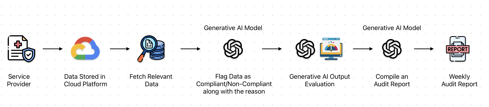

# The 15-Minute Weekly Report That Saved Millions in Regulatory Fines: Building an AI Compliance Pipeline

In the healthcare industry, non-compliance doesn't just mean paperwork problems—it means potential fines in the millions of dollars. When an organization discovered they were at risk of massive regulatory penalties due to improper documentation, they didn't have time for a traditional solution.

I'll share exactly how I built an AI compliance pipeline that protected the business from devastating regulatory fines, saved 32 hours of manual work weekly, and achieved 86% compliance accuracy—all through a simple 15-minute weekly audit report.

## The Regulatory Crisis Most Healthcare Companies Are Ignoring

Most healthcare organizations assume their compliance processes are adequate until they face an audit. The government funds a healthcare services program, paying for each completed service. But there's a catch: the service providers must document sufficient justification for each service to comply with regulatory requirements.

**Here was the crisis:**

- 1 million services provided
- 70,000 services facing potential audit
- Each non-compliant service documentation risked substantial penalties
- No system to verify if the service providers were providing adequate justification
- Manual review would require weeks of work from multiple team members

The organization needed to quickly determine which service records were at risk and implement a system to prevent future compliance failures.

## Why Traditional Compliance Methods Fail Healthcare Organizations

The standard approach to this problem would be to:

1. Hire a team of auditors to manually review thousands of documents
2. Create a complex checklist for staff to follow
3. Implement random manual spot checks
4. Hope for the best

**This approach usually fails because:**

- Manual review is painfully slow and expensive
- Humans are inconsistent in applying standards
- Spot checks miss systematic problems
- Guidelines are often ignored in daily operations

What healthcare organizations need is automated, consistent oversight with clear reporting that surfaces problems before regulators do.

## The AI Compliance Pipeline: How It Works in 5 Steps

Instead of the traditional approach, I built an end-to-end audit review pipeline using AI that could process, evaluate, and report on thousands of forms automatically.

**Here's how the system works:**

1. **Data Retrieval**: The system connects to the database where service documentation forms are stored, pulling in the free-text justifications entered by the service providers.

2. **AI-Powered Review**: Using a Generative AI model, each form is analyzed against the specific regulatory requirements. The AI doesn't just look for keywords but understands the context and determines if the justification meets the standards.

3. **Flagging System**: Each service record receives a binary classification (compliant/non-compliant) along with a specific explanation of why it passed or failed.

4. **Evaluation Mechanism**: To ensure accuracy, I built an evaluation pipeline that tests the AI against test cases, achieving 86% accuracy in identifying non-compliant service records.

5. **Automated Reporting**: The system generates a weekly 15-minute report highlighting non-compliant service documentation, summarizing trends, and providing actionable insights for management.

## The Results: Beyond Just Avoiding Fines

The impact of this system went far beyond merely avoiding regulatory penalties:

**Immediate Crisis Management:**

- Successfully identified non-compliant service records before the audit
- Allowed the organization to proactively address issues
- Provided documentation to demonstrate good-faith compliance efforts

**Ongoing Benefits:**

1. **Saved 32 hours of manual work weekly** that would have been spent on compliance reviews
2. **Improved compliance rate by identifying training opportunities** for service providers who consistently submitted inadequate justifications
3. **Provided management with visibility** into a previously opaque process
4. **Created an audit trail** that could be shared with regulators if needed

But most importantly, this system turned a potential **multi-million dollar regulatory fine** into a manageable situation.

## Implementing This Approach in Your Healthcare Organization

The beauty of this approach is that it can be adapted to various healthcare compliance challenges:

1. **Identify your high-risk documentation areas** - What regulatory requirements depend on proper justification or documentation?

2. **Define clear compliance criteria** - Work with your legal team to clearly articulate what makes a document compliant

3. **Build with existing tools** - You don't need custom infrastructure; this entire system was built using cloud-based tools

4. **Focus on the output** - The 15-minute weekly report is what makes this powerful; ensure it highlights actionable insights rather than drowning in data

5. **Iteratively improve** - Use the evaluation mechanism to continuously refine the AI's accuracy

## The Compliance Reality Most Healthcare Executives Miss

Most healthcare executives view compliance as a cost center—a necessary expense to avoid fines. But this perspective misses the strategic advantage of intelligent compliance systems.

**Smart compliance isn't just defensive—it's a competitive advantage:**

- Reduces operational costs through automation
- Improves service quality by ensuring proper protocols
- Builds trust with regulators through demonstrated diligence
- Provides data-driven insights into operational effectiveness

The organization didn't just avoid fines—they transformed their approach to regulatory compliance from a reactive scramble to a proactive system that continuously improves.

## Next Steps: Assessing Your Compliance Vulnerability

Is your healthcare organization at risk of regulatory fines due to documentation issues? Here are three questions to ask:

1. Do you rely primarily on manual reviews or spot checks for compliance?
2. Would you need more than a day to identify all non-compliant records if audited?
3. Do you lack visibility into the quality of justifications and documentation across your organization?

If you answered yes to any of these questions, your organization likely has compliance blind spots that could lead to substantial fines.

## Take Action Today

Don't wait for regulators to find compliance issues in your organization. Implementing an AI compliance pipeline is more accessible than most healthcare executives realize.

I've helped organizations implement these systems to protect against regulatory fines while reducing their compliance workload.

**Want to learn more about how this approach could work for your specific compliance challenges?** Reach out for a consultation where we can discuss your unique regulatory requirements and how an AI compliance system could help you avoid fines while saving valuable staff time.

[:fontawesome-solid-calendar: Book a Free Consultation](https://cal.com/sudhandar/discoverycall){: .cta-button}

Remember: The most expensive compliance system is the one you implement after receiving a fine.

---

*This blog post is based on a real-world project, but specific details have been generalized to protect client confidentiality. The underlying approach and results accurately represent the implemented solution.*