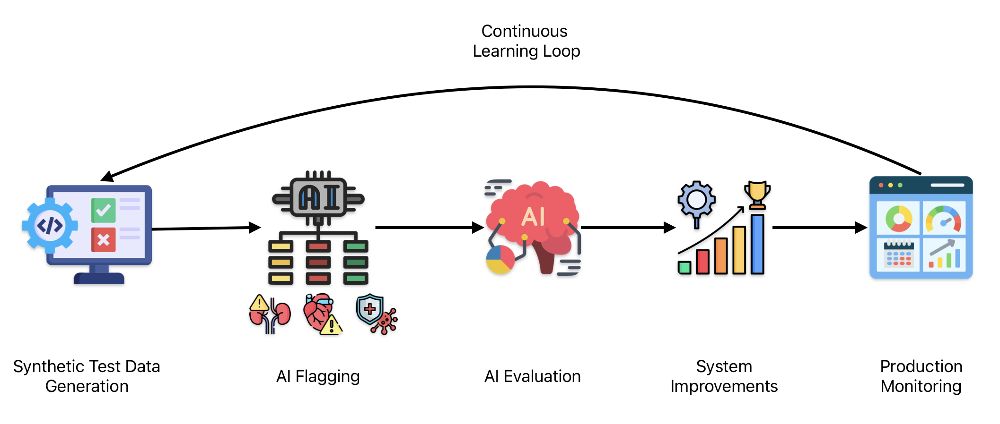

### The Hidden Goldmine in Unstructured Medical Data

Have you ever been sitting on millions of lines of unstructured medical text data, knowing there's valuable patient information hidden inside but no feasible way to extract it?

**The challenge:**

- Millions of patient and pharmacy notes containing critical condition information
- Each manual review taking approximately 30 minutes per patient
- Processing that would take months to complete with a full team
- High risk of human error and inconsistency
- Significant management overhead to coordinate data labelers

**What's at stake:** Millions of dollars of untapped revenue or, in healthcare specifically, the opportunity to improve health outcomes for thousands of patients through better-targeted services.

> **Important note:** We were extracting conditions already documented by healthcare professionals in their notes, not performing medical diagnosis.

### From Months to Hours: A Transformative AI Solution

**The results at a glance:**

- 300% increase in condition identification with 81% recall
- 1 Million free text notes processed in under 24 hours
- 10 full-time employees freed from manual review
- Complete elimination of manual flagging
- Properly targeted services for patients based on actual conditions

In this blog, I'll share the exact 6-step systematic, scalable pipeline I implemented to achieve these results. The solution not only processed the initial backlog but established a continuously improving system that scales with the ever-increasing volume of new documents.

If your team is struggling to find an automated way to extract medical information (or any structured data) from free text notes, please visit my [consulting services page](../consulting.md) or reach out directly via [email](mailto:sudhandar@gmail.com).

### The 6-Step Framework That Made It Possible

Here's the systematic 6-step framework I used to build this pipeline:

#### 1. Synthetic Test Dataset Generation

Rather than manually labeling thousands of examples, I created a synthetic test dataset covering positive, negative, and ambiguous cases using AI and domain experts. This approach eliminated extensive manual work while giving a consistent benchmark for evaluation.

#### 2. AI Condition Flagging Using LLMs

I leveraged Google's LLM with carefully designed prompts to extract approximately 10 specific patient conditions from free text. The system could identify conditions mentioned in various forms:

**Example Transformation**:

Our system was designed to identify approximately 10 specific conditions that could be mentioned in various forms:

Before: _"Pt with hx of AFib on warfarin, also c/o occasional chest pain. Had CABG 2y ago. Recent echo showed EF of 35%."_

After: _Identified Conditions: [Atrial Fibrillation, Coronary Artery Disease]_

The system successfully recognized different variations of the same condition:

- Formal terms: "Atrial Fibrillation"
- Abbreviations: "AFib", "HF", "CAD", "CHD"
- Colloquial terms: "heart problems", "irregular heartbeat"
- Misspellings: "arterial fibrilation", "coronry disease"
- Implied from procedures: "CABG" → Coronary Artery Disease

#### 3. AI Evaluation

Using our synthetic dataset, I rigorously evaluated the AI's performance, focusing particularly on recall (81%) because missing a condition could mean missing an opportunity for crucial intervention. Here I used LLM as a judge to validate the output. I've written a detailed blog about validating millions of AI outputs using LLM as a judge. [Read it here](llm-eval-blog.md).

#### 4. System Improvements

Based on evaluation insights, I implemented targeted improvements:

- Refined prompts to catch commonly missed conditions
- Brought in subject matter experts to review edge cases
- Added a secondary verification step for ambiguous mentions
- Created specialized detectors for high-priority conditions

#### 5. Production Monitoring

Once deployed, I set up comprehensive monitoring to ensure sustained performance:

- Real-time dashboards tracking evaluation metrics
- Hallucination detection and flagging
- Cost and latency monitoring
- Automated alerts for performance degradation

### 6. Continuous Learning Loop

To ensure the system improved over time, I implemented:

- Regular review of edge cases and errors
- Periodic retraining and prompt refinement
- Feedback integration from subject matter experts

### The results speak for themselves:

* A scalable condition identification pipeline that increased identification by 300%
* Successfully implemented across 1 million free text notes with 81% recall
* Cut identification from months to hours
* Completely eliminated human data labeling, freeing up 10 employees' valuable time

### Building Trust in AI-Powered Healthcare Solutions

One of the significant challenges we faced was building trust in an AI system making determinations that would affect patient care. Healthcare stakeholders needed confidence in the system's reliability and transparency.

By implementing rigorous evaluation metrics and continuous monitoring, I created a foundation of trust through quantifiable performance measures. The system's 81% recall rate wasn't just a technical metric, it represented the reliability patients and providers could expect.

For a deeper dive into how I quantify and build trust in AI systems like this one, check out my blog on [quantifying AI trust](llm-eval-blog.md).

### Beyond Healthcare: Applications Across Industries

This same framework can be readily adapted to extract valuable insights from unstructured text in virtually any domain:

- **Legal:** Law firms can identify critical clauses and obligations across thousands of contracts, reducing attorney review time from hours to minutes while improving risk identification by 200%+.

- **Customer Experience:** Companies can analyze support tickets and reviews to automatically categorize product issues, detect emerging problems, and identify improvement opportunities with 3x the accuracy of keyword-based approaches.

- **Financial Services:** Banks and insurance companies can extract relevant risk factors and financial obligations from loan documents, regulatory filings, and policy agreements, accelerating compliance reviews while reducing manual processing by 80%.

- **Supply Chain Management:** Manufacturing and logistics companies can analyze thousands of supplier communications, shipment notes, and quality reports to automatically identify supply chain risks and disruptions. 

The core architecture remains nearly identical across these applications, only the extraction targets and domain-specific evaluation metrics require customization.

Need help implementing a similar system for your organization? I help companies deploy AI solutions that deliver measurable business outcomes. [Schedule a Free Growth Assessment Call](https://cal.com/sudhandar/discoverycall) to brainstorm about your specific challenges.