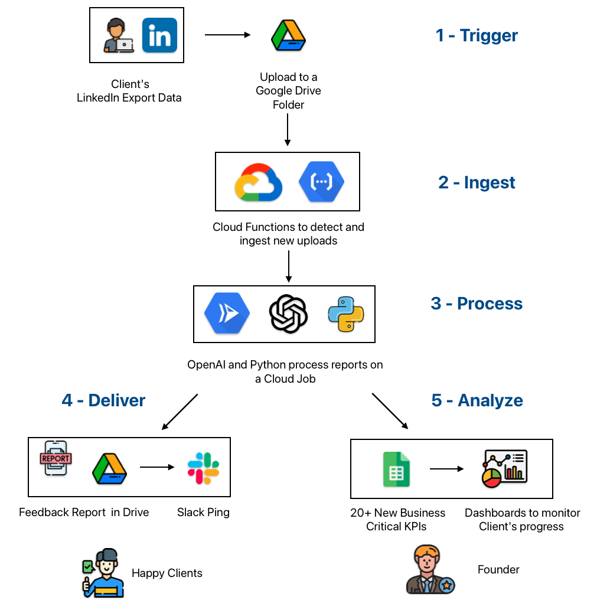

> **TL;DR** – An overwhelmed solo founder was spending 30 + hours a week on manual client feedback. In just eight weeks we shipped an automated, AI-driven reporting system that slashed turnaround from days to minutes and unlocked **3× growth without hiring**.

### The Scaling Ceiling

If you run a high-touch service business, every new client feels like another spinning plate. **Dataship**, a career-coaching startup, knew that pain all too well. Demand was high, clients were happy, yet growth had flat-lined because the founder simply couldn’t squeeze another hour into his calendar.

- **50 + active clients** 
- **30–35 hours/week** spent hand-reviewing LinkedIn outreach logs  
- **Feedback latency:** **2–3 business days** (or longer during busy weeks)  

The result? Burnout for the founder and mounting frustration for clients who needed timely guidance.

### Why This Happens (And Why It's Not Your Fault)

Most founders fall into this trap because they confuse high-touch service with manual processes. Here's the difference:

- **High-touch service:** Personalized, expert-level guidance that clients value
- **Manual processes:** Repetitive tasks that follow the same pattern every time

The problem? We treat everything as high-touch when much of it follows predictable patterns.

### Diagnosing the Bottleneck

We mapped the entire client journey and uncovered a single choke-point:

!!! danger "**Manual feedback on LinkedIn networking efforts** wasn’t just time-consuming, it was Dataship’s **biggest bottleneck**, packed with failure points that regularly tripped clients up."

Every time a client exported new LinkedIn data, the founder had to:

1. Download the CSV  
2. Comb through dozens of conversations  
3. Write bespoke suggestions  
4. Notify the client via Slack  or join a zoom call

Multiply that by 50 clients and you get a recipe for stalled growth.

### The AI Solution in 8 Weeks

We built an end-to-end **AI Report Generation Engine** hosted on Google Cloud Platform that now does the heavy lifting:

1. **Trigger** – Client drops their LinkedIn export into a shared Google Drive folder.  
2. **Ingest** – Cloud Functions detect the file and hand it to a LangChain pipeline.  
3. **Process** – OpenAI models generate multi-page, conversation-level feedback.  
4. **Deliver** – Feedback report lands in the client’s Drive and a Slack alert pings them.  
5. **Analyze** – 20 + networking KPIs are written to **Google Sheets** for dashboards.  

#### Build Timeline

| Week | Milestone                                                             |
|------|-----------------------------------------------------------------------|
| 1    | Rapid prototype & sample report                                       |
| 2–6  | Core build, pilot with power users, iterative prompt tuning           |
| 7–8  | Harden for scale, add monitoring, roll out to all clients             |

*Total engineering time:* **8 weeks, start to finish.**

### Results: What “3× Capacity” Looks Like

| Metric                     | Before              | After            |
|----------------------------|---------------------|------------------|
| Feedback turnaround        | 2–3 business days   | **< 10 minutes** |
| Founder hours on feedback  | 30 + hrs/week       | **0 hrs/week**   |
| Revenue capacity           | 1×                  | **3×**           |

Beyond the numbers, clients now rave about instant, actionable insights, while the founder finally has time to focus on growth initiatives instead of inbox triage.

### The Three Critical Success Factors

**1.We Automated Expertise, Not Just Tasks**  

   - Captured the founder's decision-making framework  
   - Trained AI on their specific quality standards  
   - Preserved their unique methodology and voice  

**2. We Kept the Existing Workflow**  

   - Clients still drop files into Drive  
   - Reports appear in the same format  
   - Slack notifications maintain the familiar communication rhythm  
   - Zero retraining required  

**3. We Built for Edge Cases From Day One**  

   - Engine auto-handles ~95 % of scenarios  
   - Real-time error alerts
   - Detailed test suite to cover edge cases  

!!! info "**Critical Question We Asked:** *'If you trained someone else to do this, what would they need to know?'*.  This became our AI’s knowledge base."

**Excerpt from the client's review:**

> Our customers now get instant feedback instead of waiting for a call, and one even said.*“Wow I love that I can get instant feedback and don’t have to wait for us to jump on a call to review.”*

Remember: Your clients don't care if feedback comes from you typing or from your AI system trained on your expertise. They care about getting actionable insights quickly.

P.S. If manual processes are capping your growth, I'd love to help you identify automation opportunities. [Book a free growth assessment](https://cal.com/sudhandar/discoverycall) to see what's possible.

