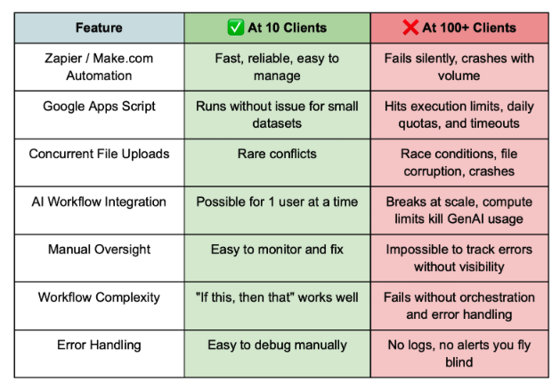

Your Google Suite automation using No code automation tools and App Scripts worked perfectly for a small number of accounts and folders. But when you tried to scale the automation and make it intelligent, everything broke. You hit a roadblock.

Does this scenario sound familiar?

This exact scenario happened to my client DataShip. They had a mentorship business and wanted to scale 3x their current user base to handle 100+ clients with 500+ folders. They have their entire infrastructure built under Google Suite:

* Drive to store data, folders, sheets and other documents
* Docs to store their text, reports and unstructured data.
* Sheets to store their structured and numerical data.

They used Zapier and Apps Script for small automations.It worked great. Until it didn't.

When they tried to scale their automation system in house using Google's Native App Script and no code tools like Zapier, it completely failed.

After spending 8 weeks building their automation using Google Cloud, I learned something important:

**If you're trying to automate Google Suite for a growing business and want to scale massively, you'll face these exact same problems.**

 Let me show you what breaks and why.

### Scalability is a nightmare

#### No-Code Tools Hit a Wall

No code tools Zapier and Make.com work great for personal use. They're perfect for single accounts.

But they can't handle 100+ accounts. Here's what happens:

- Zapier demos show 3 test folders working perfectly.
- You build automation for 20 clients and it works fine.
- You add multiple new clients - everything crashes.
- No warning. No gradual slowdown. Just failure.

#### Google's App Script won't let you expand

Apps Script hits similar walls. It has a 6-minute execution limit. Processing 100+ client folders takes hours. You'll hit daily quotas and timeouts constantly.

**The result?** You waste weeks building something that works for a small set of users but fails when to try to increase the user base.

### The Concurrent Operations Challenge

Here's what no one tells you about Google Drive automation using no code tools and App Script:

**Multiple people can't use it at the same time.**

When 5 team members upload files simultaneously, race conditions happen. Files get corrupted. Processes crash. 40% of uploads fail to process correctly.

There's no coordination between different automations. One process starts while another is running. They fight for the same resources. Both fail.

### You Can't Add Intelligence using GenAI

Want to use ChatGPT in your automation for 100s of clients? Good luck.

You can add a GenAI model for a single user workflow. No-code tools can't handle AI workflows at scale. 

Apps Script lacks the compute power for AI processing. It has a 6 minute execution time limit.  You're stuck with basic "if this, then that" logic. 

Let's say you want to analyze documents of your clients or employees and generate personalized reports for each one of them. Both no code tools and App Script automations fail to perform that effectively on scale.

### The Integration Tangle

Your automation starts simple: "Google Drive → Google Sheets"

Then business needs grow: "Google Drive → AI Processing using ChatGPT → Report Generation → Google Docs → Email Alerts"

Each step needs different authentication. Each integration point can fail. There's no orchestration between systems.

### Silent Failures Kill Your Business

When something breaks, you can't tell which step failed. Was it the Google Drive trigger? AI processing? The email sent? You're flying blind.

Google Suite automation fails silently. No alerts. No notifications. The system just stops working. You discover problems only when clients complain.

No audit trails. No logs. No dashboards for non-technical team members. When something breaks, you're playing detective instead of running your business.

### Building In-House Trap

Maybe you think: "I'll just build this in-house."

Here's what happens:

Building Google Suite automation at scale takes months, not weeks. Most projects get abandoned halfway through. The complexity grows exponentially.

Apps Script only supports linear workflows. Want conditional logic? Multi-branch processes? Human approval steps? You're writing complex custom code with hacks.

No version control. No modern development practices. You're building mission-critical business automation with consumer-grade tools. 70% of in-house automation projects fail or get shelved.

### The Real Cost

**Operational Cost:** Let's assume you are spending 100 hours monthly on manual processes. At $500/hour opportunity cost, that's $50K monthly trapped in operations. That's $600K yearly. 

**Revenue Cost:** Your growth is directly limited by manual work capacity. You couldn't take on new clients. Let's assume you could take on 3x more than your current client base with no new hires required. That's 3x more potential revenue. Each month without proper automation costs your business potential revenue. Competitors with better automation systems are winning deals they couldn't handle manually.

**Burnout:** When your business depends on manual processes, you can't take vacation. You can't get sick. The business stops when you stop.

Here’s what I’ve seen firsthand across multiple projects.

### Why This Matters

You're not failing at automation. You're using tools that aren't built for your scale.

The promise of "easy automation" works until you need real business results. Then you discover the limitations everyone else learned the hard way.

In the future posts, I'll share the exact solutions I used to solve these problems and build an automation that could scale

Ready to discuss your Google Suite automation challenges? 

Curious whether your current setup can scale?

I offer a free growth assessment call to explore your automation bottlenecks and opportunities.

[:fontawesome-solid-calendar: Book a Free Growth Assessment Call](https://cal.com/sudhandar/discoverycall){: .cta-button}

To know more about my exact process to build scalable automation in 8 weeks, please visit my [consulting services page](../consulting.md)
