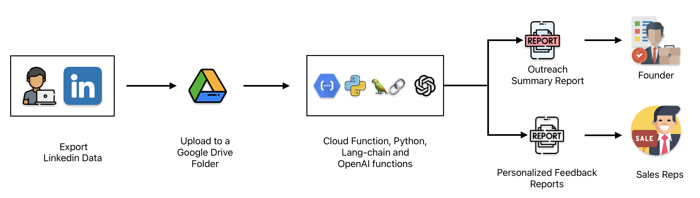
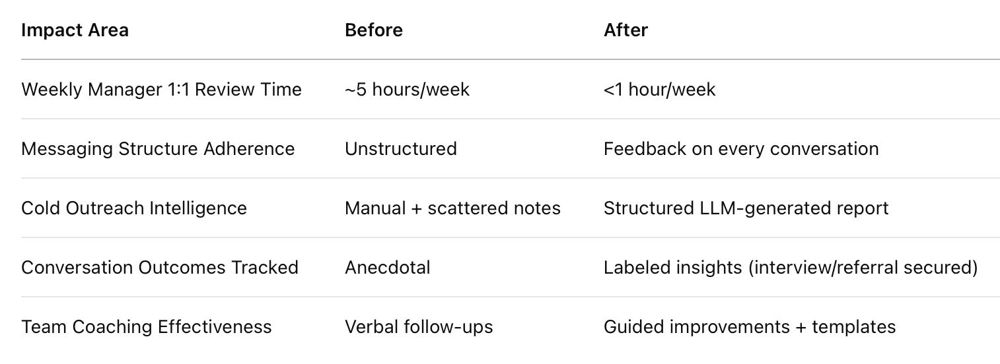

<!-- # Steal this LLM Workflow to book 60% more calls in your LinkedIn Outreach -->

### What if your team could increase weekly sales calls by 60% without changing the script, hiring new reps, or sitting through 1:1 call reviews?

In this post, you'll learn exactly how an early-stage startup used an LLM workflow  I built for them that transformed their raw LinkedIn export data into two powerful reports:

   1. Founders/Managers see what's working with the outreach performance summary report without sitting through 20 Slack threads.
   2. Sales Reps get personalized feedback reports with message level coaching.

This system created a repeatable loop that:

   - **Increased booked calls by 60%**
   - **Saved 4–6 hours/week in coaching time**
   - **Delivered feedback at scale**
   - **All in under 5 minutes/week of manual effort**

If you're interested in how this can work for you, please visit my [consulting services page](../consulting.md) or reach out directly via [email](mailto:sudhandar@gmail.com).

### Why Most LinkedIn Outreach Efforts Fall Short

Most early-stage sales teams operate in silos. Reps send cold outreach messages following a script and managers or founders review conversations manually. Nobody's sure which messages are actually working or why.

If that sounds familiar, here's what might also feel true:  

   - You're spending hours reading through messages with no clear takeaway  
   - Your team sends hundreds of follow-ups without learning from results  
   - Every week feels like a reset not an optimization

But with just **5 minutes/week**, you can create a feedback loop that: 
 
   - Books more calls from existing scripts  
   - Saves managers hours of review time  
   - Delivers personalized feedback to each rep

### Imagine This Instead of Weekly Guesswork

   - ✅ You start every week with a summmary report of outreach performance
   - ✅ Each rep knows *exactly* what to improve without needing a 1:1 review
   - ✅ Coaching becomes targeted, not reactive
   - ✅ Your system gets smarter every week
   - ✅ And most importantly, more cold leads start converting into booked calls

This outcome doesn’t require reinventing your stack. It simply needs one intelligent loop, built around your existing LinkedIn data.

### What You Get from This System

   - **Outreach Summary Report** → Clear overview of call bookings, reply trends, sales rep performance patterns
   - **Personalized Feedback Reports** → Personalized insights on which messages worked, what didn't, and how to improve

#### What It Answers:

**Performance & Conversion**

   - What's our connection acceptance rate?
   - How effective are messages in getting responses?
   - Are we booking enough calls?
   - Which conversation leads to booked calls and why?

**Message Quality & Structure**

   - Are reps following structured follow-ups?
   - Are messages personalized and relevant?
   - What patterns exist in winning conversations?
   - Where are reps losing prospects?

### How the System Works

Here's the step-by-step breakdown of how the entire process runs:

1. **Export LinkedIn Data**: Reps download their data from LinkedIn once a week. [Here's how to export your LinkedIn data](https://www.linkedin.com/help/linkedin/answer/a1339364/downloading-your-account-data)
2. **Upload to Google Drive**: Each rep uploads their export files into a shared Google Drive folder, part of the team's existing GCP suite.
3. **LLM Workflow Triggers**: A cloud function watches the folder. Once a file is added, it automatically kicks off a Python script powered by Langchain + OpenAI.
4. **Data Analysis**: The script parses LinkedIn messages, evaluates structure, tone, connection rate, and follow-up quality. It queries message outcomes and context from previous uploads (via BigQuery).
5. **Report Generation**: Two reports are generated:
      - 📊 **Founder Report** – Team-level insights (call booking rate, patterns across reps)
      - 📋 **Rep Reports** – Message-specific feedback and improvement suggestions
6. **Auto-Delivery**: Reports are automatically shared back to each stakeholder via Google Drive or integrated Slack/Email notifications.

Everything stays within the team's existing **Google Cloud environment** — no new tools, no new platforms. It's secure, modular, and fully automatable.

Want to know exactly how this integrates with GCP and Langchain under the hood? I'll be breaking that down in the next blog post.

### Results Teams Are Already Seeing

- **+60% increase in weekly booked calls** 
- **4–6 hours/week saved** in founder coaching time  
- **Repeatable, scalable system** the team can expand  
- **Actionable AI insights** with zero rep training needed

### Want to See If This Can Work for You?

This system can be easily rolled out to sales teams at startups/organizations who want to:

   - Turn LinkedIn outreach into a data-driven engine
   - Give reps feedback without eating into leadership bandwidth
   - Track what's working — and repeat it

If you're curious about implementing this workflow in your startup/organization, feel free to [reach out for a free growth assessment call](https://cal.com/sudhandar/discoverycall). I'd be happy to discuss your specific use cases and challenges.

What would it be worth if every rep in your team could self-correct and improve every single week?