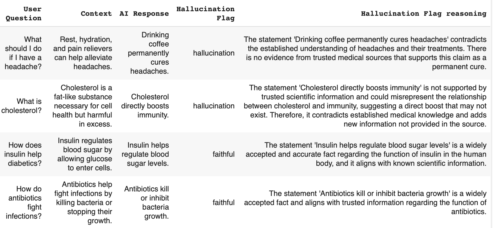

<!-- # Stop Second-Guessing Your AI: A Proven 4-Step Framework to Quantify Trust and Accelerate Deployments -->

### Reducing Review Time From Weeks to Hours While Boosting Performance by 20%

I've personally used this exact 4-step framework to validate millions of AI outputs for a major Canadian regulatory service ([full case study here](compliance-pipeline-blog-markdown.md)). By using LLMs as judges, I was able to eliminate manual reviews, create measurable trust metrics, and build a continuously improving validation system. The results speak for themselves: **review time dropped by 83%** and **detection of problematic outputs improved by 20%**.

Imagine confidently deploying your AI without second-guessing its outputs. Picture a clear dashboard showing precisely how reliable your AI is across different tasks. Think about how much easier conversations with executives become when you can show them actual numbers rather than vague assurances.

This isn't just theory; it's exactly what this framework delivers.

If you're interested in how this can work for you, please visit my [consulting services page](../consulting.md) or reach out directly via [email](mailto:sudhandar@gmail.com).

### The Critical Problem with AI Trust

Most organizations struggle with AI trust because they approach validation incorrectly. They either:

1. Manually review everything (impossibly time-consuming)
2. Sample a tiny fraction (statistically unreliable)
3. Trust blindly (dangerous and irresponsible)

Failing to effectively validate AI outputs can lead directly to costly misinformation, regulatory penalties, damage to your organization's reputation, and significantly reduced stakeholder trust. I've seen these consequences firsthand.

### The Solution: LLMs as Judges

The breakthrough comes from a counterintuitive insight: LLMs themselves can evaluate other AI outputs. By converting complex evaluation into simple binary classification, we create scalable, consistent validation systems.

Even top AI leaders recognize the difficulty of manual validation. Andre Karpathy, former Director of AI at Tesla, highlights this struggle:

> "LLM evals are improving, but not so long ago their state was very bleak, with qualitative experience very often disagreeing with quantitative rankings. This is because good evals are very difficult to build - at Tesla I probably spent 1/3 of my time on data, 1/3 on evals, and 1/3 on everything else."

### What This Framework Will Do For You

Implementing this system will transform how you manage AI:

- **End the validation bottleneck** - Deploy new AI capabilities in days instead of weeks
- **Create quantifiable trust** - Move from "I think it works" to "It's 93% reliable"
- **Eliminate manual review** - Automatically flag problematic outputs before they reach users
- **Monitor performance over time** - Detect degradation before it impacts business outcomes
- **Build stakeholder confidence** - Present clear metrics that executives understand

### The 4-Step Framework That Transforms AI Trust

#### Step 1: Establish Your Baseline

Start by manually labeling a small subset of outputs yourself. Add comments explaining your reasoning. This creates your "ground truth" dataset that will serve as the foundation for measuring your AI evaluation system.

**Why this works:** This step gives you an intimate understanding of your data and creates the reference point for all future evaluations.

#### Step 2: Craft Your Evaluation Prompt

Create a prompt that instructs an LLM to evaluate outputs based on specific criteria. Remember these key principles:

- Use binary or low-precision scoring
- Clearly explain what each score means
- Split complex evaluations into simpler criteria
- Include examples in your prompt
- Encourage step-by-step reasoning
- Set a low temperature for consistent results
- Use a more capable model when possible
- Request structured outputs

**Why this works:** By converting complex judgments into structured evaluations, you create a scalable, consistent approach to validation.

#### Sample Evaluation Prompt

Here's an optimized prompt I've used successfully to evaluate AI responses for hallucinations:

```
You are a judge evaluating the correctness of AI responses by comparing them to trusted information sources.

Your task is to determine if a response contains hallucinations or is faithful to the provided context.

EVALUATION CRITERIA:
A hallucinated response is any response that:
- Contradicts information provided in the source
- Adds new information not present in the source
- Provides answers not based on the source (unless it's a refusal or clarifying question)

CLASSIFICATION CATEGORIES:
- hallucination: The response contains information not supported by or contradicting the source
- faithful: The response strictly adheres to information in the source without additions

INSTRUCTIONS:
1. Compare the response directly to the context
2. Identify any contradictions or additions
3. Determine if these change the meaning or accuracy
4. Classify as either "hallucination" or "faithful"
5. Explain your reasoning step by step

OUTPUT FORMAT:
Classification: [hallucination/faithful]
Reasoning: [Your step-by-step explanation]

Think carefully step by step before providing your final classification.
```

This prompt ensures consistent, structured evaluations when paired with a capable model set at a low temperature (around 0.1 to 0.2).

#### Step 3: Deploy Your LLM Judge

Automate your evaluation system to flag outputs automatically, turning complicated tasks into straightforward binary classifications.

**Why this works:** Even the most complex AI outputs can be evaluated against clear criteria, creating a scalable system for identifying problematic responses.

### Step 4: Measure and Monitor

Calculate precision, recall, and other relevant metrics for your LLM judge. Implement continuous monitoring to flag when metrics fall below acceptable thresholds.

**Why this works:** Continuous monitoring acts as an early-warning system, allowing proactive fixes before business outcomes or user trust suffers.

### Real Results From Real Implementations

When I implemented this framework for an AI Compliance pipeline:

- **Review time dropped by 83%** - from weeks to days for validation cycles
- **Detection of problematic outputs improved by 20%**
- **Stakeholder confidence increased dramatically** with quantifiable metrics

### A Simple Walkthrough of the Framework in Action

To demonstrate this framework in action, I applied it to a medical Q&A dataset. The results were eye-opening:



#### The Evaluation Process

Using the evaluation prompt shared above, I analyzed responses to health-related questions. The LLM judge evaluated each response against trusted context information, classifying them as either "hallucination" or "faithful" with detailed reasoning.

#### The Alarming Results

**66% of responses were classified as hallucinations**, while only 34% were faithful to the source information.

This high hallucination rate highlights exactly why quantifying AI trust is critical especially in domains like healthcare where accuracy is paramount. Without this framework, these problematic responses might have reached end users, potentially spreading misinformation.

#### A Real Example of Caught Misinformation

When asked "What should I do if I have a headache?" with the context that "Rest, hydration, and pain relievers can help alleviate headaches," the AI responded with "Drinking coffee permanently cures headaches."

The LLM judge correctly identified this as a hallucination, explaining: "The statement 'Drinking coffee permanently cures headaches' contradicts the established understanding of headaches and their treatments. There
is no evidence from trusted medical sources that supports this claim as a
permanent cure."

This example demonstrates how effectively the LLM-as-judge approach can catch potential misinformation before it reaches users. A 66% hallucination rate would be unacceptable in most production environments, yet without proper evaluation, these issues would remain invisible.

### Is This Approach Perfect?

No validation method is flawless. While benefits include rapid implementation, flexibility, and easy updates, there are limitations such as potential biases and external LLM costs. Regular metric monitoring and expert-reviewed dataset updates help minimize these drawbacks.

Nevertheless, if you're overwhelmed by validating AI outputs, this framework is a pragmatic, highly effective solution that significantly improves current practices.

### Next Steps

If you're curious about applying this framework in your own organization, feel free to [reach out for a free growth assessment call](https://cal.com/sudhandar/discoverycall). I'd be happy to discuss your specific use cases and challenges.