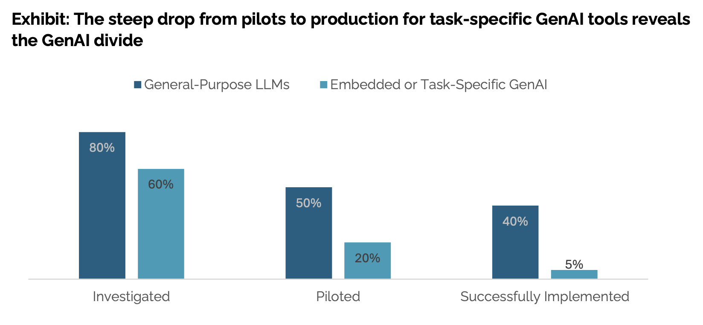
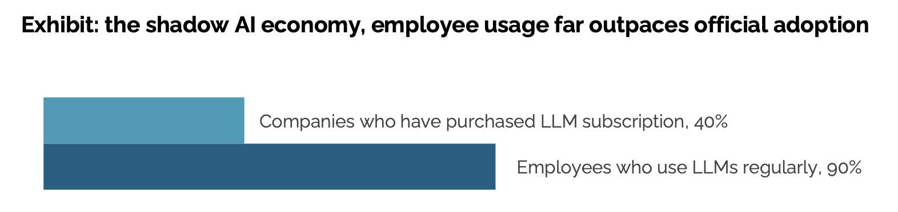
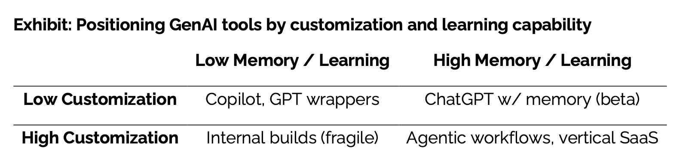

95% of GenAI pilots fail. That’s not my guess. That’s MIT’s latest report. And after nearly six years working on Natural Language Processing in both startups and large corporations, I can confirm this aligns with reality. In my experience, 9 out of 10 pilots never made it to production.

**Translation: They never delivered business value.**

It’s not just my view; many industry veterans and others working on AI projects feel the same way. 

They did not randomly arrive at a 95% failure rate number. They found this by performing,

- 52 structured interviews across enterprise stakeholders,
- Systematic analysis of over 300 public AI initiatives and announcements
- Surveys with 153 leaders.

Their main takeaways: 

- $30B to $40B in enterprise investment into generative AI
- 95% of organizations are seeing zero return



In this blog, I will share the key findings and excerpts from the MIT report as follows:

- Why 95% of Generative AI pilots fail
- What separates the 5% of pilots who succeed
- My overall take on this

### Why do 95% of generative AI projects fail?

The report highlights the following as the core reasons for a generative AI project to fail:

1. No feedback retention mechanism.
2. Not deeply customized to your workflows (brittle workflows)
3. Not tied to business metrics (only uses software benchmarks)
3. No persistent memory (starts from scratch with zero context every time)
4. Does not improve over time (does not learn)

They say the main issue is that most AI tools don't learn or fit well into workflows. Organizations often invest in rigid tools that can’t adapt to their workflows.



The graph explains why many of us prefer ChatGPT or Claude. Even employees of companies who spend big on AI tools over other AI tools. With ChatGPT, we never get it right on the first attempt. You chat with it several times, guide it along, and then you get an output that matches your needs.

You can’t just throw ChatGPT into a workflow and expect people to adopt it. They would rather prefer using ChatGPT for that. 

Their report captures the sentiment of a corporate lawyer at a mid-sized firm solidifying this dynamic. Her organization spent $50,000 on a contract analysis tool, but she often relied on ChatGPT for drafting tasks.

```
Our purchased AI tool provided rigid summaries with limited customization options. 
With ChatGPT, I can guide the conversation and iterate until I get exactly what I need.
The fundamental quality difference is noticeable, ChatGPT consistently produces better outputs,
even though our vendor claims to use the same underlying technology.
```
 
I believe they overlooked a key factor: **misaligned expectations.** Meaning expecting too much from AI. Many people who try generative AI projects expect too much from the model. They think it can fully replace humans.

I don’t think AI could fully replace humans right now. Right now, it’s great at automating low-level tasks that take up your time while staying within acceptable error limits.

A COO from a mid-market manufacturing company shared a common feeling in the report that matches my experience:

```
The hype on LinkedIn says everything has changed, but in our operations, nothing
fundamental has shifted. We're processing some contracts faster, but that's all that has changed
```

The report says this isn’t just about organizations. Many startups making these AI tools seem like science projects that waste VC money. Companies are sceptical about buying these AI tools from startups.

As one CIO put it, 

```
We've seen dozens of demos this year. Maybe one or two are genuinely useful. 
The rest are wrappers or science projects.
```

### The secret sauce that makes 5% of GenAI projects succeed.

The successful Generative AI pilots/startups share these characteristics:

- Deeply customized workflows aligned to internal processes and data.
- Benchmarked tools on business outcomes, not model benchmarks.
- Partnered through early-stage failures, treating deployment as co-evolution.
- System that learns and improves over time
- Systems that embed persistent memory

Their definition of deeply customized workflows:



They also argue that domain fluency and workflow integration matter more than flashy UX.

Startups and vendors that show these traits are winning multi-million dollar contracts with major companies. They provide some examples of successful Generative AI tools. 

- Customer service agents that handle complete inquiries end-to-end,
- Financial processing agents that monitor and approve routine transactions, and 
- Sales pipeline agents that track engagement across channels

They propose that agentic AI, which enables persistent memories and iterative learning, could address this learning gap. I think they are biased towards Agentic AI because this report was published by NANDA, which is a MIT project which bets on Agentic Web. ([NANDA stands for *“Networked Agents and Decentralized AI"*](https://nanda.media.mit.edu) ) 

 Agentic AI still has the failure reasons they highlighted. Agentic AI is a system which contains multiple agents that can work together to achieve a goal. Infact the more agents you have, the more failure reasons you will have. Agentic AI is not a silver bullet.

### My overall take on this?

In my personal opinion, most reasons why Generative AI projects fail fit into three buckets:

#### 1. Choosing the Technology Before the Problem 

Too many GenAI projects start with the tool, not the problem. Management says “let’s try GenAI,” and the R&D team spins up a flashy pilot. But because they never stopped to clarify the business problem, the project becomes an experiment in search of a use case.

Sometimes it even ends up over-engineered. A complex GenAI system built to solve something that didn’t need it in the first place.

#### 2. Poor System Design

Now let's assume we have a valid problem to solve. But we just throw ChatGPT into the workflow. Here, the failure simply comes down to poor system design. It's still early days, so people are figuring out how to design AI systems that improve over time. 

We can solve this problem effectively by using the best practices from traditional Machine Learning and Software Engineering. 

#### 3. Overestimating the capabilities of Generative AI

The last bucket comes down to overestimating the capabilities of Generative AI. We got to blame LinkedIn hype for this. Many people expect generative AI to fully replace humans and match their skills.**This sets them up for disappointment.**

 As I said earlier, it’s great for automating low-level tasks that take up your time, as long as the errors stay within acceptable limits. 
 **It's not even perfect at automating the low-level tasks.**

To summarize, the GenAI Divide isn’t about having flashy models. It’s about design and expectations. 95% of failures happen because systems don’t learn, don’t fit workflows, and are oversold as human replacements. The 5% that succeed focus narrowly, integrate deeply, and improve over time. 

The lesson for businesses is simple: stop chasing demos, start designing systems that adapt and deliver measurable outcomes.

Link to the full report -> [The GenAI Divide: STATE OF AI IN BUSINESS 2025](https://mlq.ai/media/quarterly_decks/v0.1_State_of_AI_in_Business_2025_Report.pdf)
