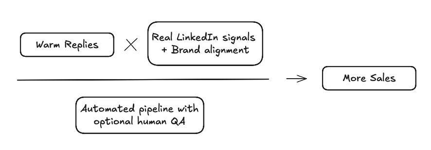
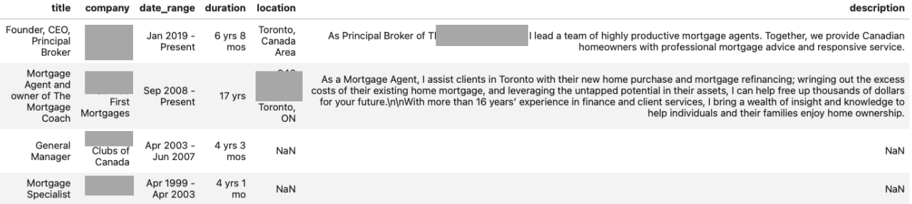

<!-- The 4-Layer LinkedIn System That Turns Cold Outreach Into Warm Replies -->

Cold outreach is supposed to start conversations but most of the time, it ends up being ignored.

The reason is simple: the message feels like it could have been sent to anyone. Most teams do it manually or use outreach automation tools like Lemlist, Apollo.io, etc., to execute it. Even if you're using these tools, two problems never go away:

1. The message lacks real personalization that shows you understand the person you're reaching out to
2. The tone rarely matches your company's actual voice or brand

That’s why so many emails stay “cold.” They’re technically delivered, but they don’t feel human.

This blog is about fixing that problem. I’ll walk through a 4-layer LinkedIn system that takes cold outreach and makes it feel warm not by guessing, but by pulling real signals from your leads' activity and fitting it into your company’s brand voice. It runs with near-zero manual effort (with an optional human-in-the-loop review)

The result isn’t just more replies but better replies, because you’re talking to the right people in the right way.



This can be achieved via a four-layer process:

1. **Lead Gathering Layer** - Identify leads that fit your ideal customer profile.
2. **Data Enrichment Layer** - Gather more information about the leads from LinkedIn than just their profile information.
3. **Personalization Engine** - Personalize the outreach message for each lead based on the lead's activity on LinkedIn and your company's branding and voice
4. **Outreach Execution** - Execute the outreach message to the leads via email.


### Lead Gathering Layer:

This layer involves two steps:

1. Identifying the leads that fit your ideal customer profile
2. Qualifying the leads based on the ideal customer profile

The first step here is identifying who we want to reach out to and defining the search criteria. Every company's needs and requirements are different. This is where we make use of the company's Ideal Customer Profile to identify the leads.

Let's assume we are part of a company called LendFlow Technologies, which helps streamline application processing, automate underwriting workflows, and improve compliance tracking for mortgage professionals. We need to select our leads so that they are tailor-made for the company's Ideal Customer Profile. The clearer we are with our Ideal Customer Profile, the better the results we will get.

**Target Audience:** 100 CEOs/Founders/Presidents of small to medium-sized Financial Services companies in Toronto, Canada.

This could be a good starting point for our search criteria. We could refine it further based on the company's Ideal Customer Profile. I have attached an example of the search criteria below:

**Search Criteria:**

```
Title Keywords: CEO, Chief Executive Officer, President, Founder
Functions: Finance
Company Headcounts: 11-50, 51-200
Location: Greater Toronto Area, Canada
Company Type: Public Company, Privately Held
```

After defining the search criteria, we can use the LinkedIn API to search and extract the profiles of the leads. We could extract the following information:

1. Profile Information
2. Employment History
3. Education History

Here is an example of the real profile information we could get. I have anonymized the name and company for privacy reasons.

**Profile Information:**

```
first_name                                                           Anonymized
last_name                                                            Anonymized
job_title                                        Founder, CEO, Principal Broker
city                                                                    Toronto
company                                                      Anonymized Company
company_domain                                               Anonymized Company
company_employee_range                                                   51-200
company_industry                                             Financial Services
company_website                                      https://www.anonymized.ca/
company_year_founded                                                     2008.0
country                                                                  Canada
current_company_join_month                                                  1.0
current_company_join_year                                                  2019
headline                                                                    NaN
hq_city                                                                 Toronto
hq_country                                                                   CA
hq_region                                                               Ontario
location                                               Toronto, Ontario, Canada
school                                               Toronto School of Business
state                                                                   Ontario
```

**Employment History:**



**Education History:**

```
school                                               Toronto School of Business
date_range                                                            1992-1993
field_of_study                                                    Not Available
activity_status                                                   Not Available
```

The above information is just a sample of one profile. I have identified 100 profiles for the search criteria for the purpose of this blog.

Now that we have the list of leads, we need to qualify them. This is where we can use the Ideal Customer Profile to qualify the leads.

Even though we defined the search criteria using the Ideal Customer Profile, not all of the extracted profiles would be the right match. We could use Generative AI to qualify the leads based on the Ideal Customer Profile. I have attached an example of the prompt below:


```
ROLE: You are a Lead Qualification Specialist responsible for determining whether prospects fit the Ideal Customer Profile (ICP) for a LinkedIn cold outreach automation tool.

IDEAL CUSTOMER PROFILE (ICP) CRITERIA:
<Insert ICP for the company here>

LEAD PROFILE DATA:
<Insert Lead LinkedIn Profile Data here>

TASK: Review the lead’s LinkedIn profile against the ICP criteria and decide if the lead qualifies as a potential prospect.

OUTPUT (JSON format only):
{
  "qualified": true/false,
  "qualification_reason": "Brief explanation of why the lead is qualified or disqualified"
}

EXAMPLES:

<example-1>

<example-2>

```

It's a simple true/false filtering process using the profile information. This step essentially helps us target our efforts toward the right leads. Now we have a filtered list of qualified leads based on the Ideal Customer Profile.

### Data Enrichment Layer:

This is the crucial step that sets us apart from other automation tools out there. For qualified leads, we don't just use their LinkedIn Profile Information. We collect various information about the leads from LinkedIn as follows:

1. Recent Posts in the Last 90 days
2. Posts they have reacted to (liked, celebrated, etc.)
3. Posts they have commented on

The main reason behind this step is to get a complete picture of the lead.

- Who is our lead as a person?
- What are their likes and dislikes?
- What are their interests? 
- What are the topics they engage with?

This plays a crucial role in personalizing your outreach message instead of using generic profile information. To understand this better, I will show an example of a profile with their post information below:
 
```
PROFILE CONTEXT:

Name: Anonymized
Role: Founder and CEO at Anonymized
Company Details: Anonymized | Financial Services | 11-50 employees | Founded 2012
Location: Toronto, Ontario, Canada

Background: Anonymized founded Anonymized in 2012. A payments industry thought leader, she is also avid supporter of fintech.
Anonymized is a sought-after advisor to  a number of fintechs at various stages, as well as holding non-executive director roles.
She has participated as a judge for various fintech awards and accelerators around the world.

Prior to founding Anonymized, Anonymized consulted extensively in payments and fintech, where her clients included financial institutions, 
payment networks, and other leaders and stakeholders in the global payments arena. 
Anonymized also worked at a tier one Canadian bank, in leadership positions in global transaction banking, treasury, finance and operations.  

Anonymized is frequently invited to speak at global industry fora on topics of payments innovation, fintech, and diversity. 
Anonymized is a registered Professional Engineer, and holds a Bachelor of Applied Science and Engineering from the University of Toronto.

Company Tenure: Joined 2/2012
Education: University of Toronto
Company HQ: Mississauga, Ontario, CA

RECENT ACTIVITY (Posts):

**Post 1** (Posted: 2025-08-22)
Post Content: "I'm excited to announce that I will be speaking at Money 20/20 in Riyadh, Saudi Arabia, September 15-17. 
 Saudi Arabia is a hugely dynamic market, and I'm looking forward to engaging on all things fintech and DEI.    
 Please join me, and use this code for a special registration pass. 
 I look forward to engaging with you all at the event!  
 #Money2020MiddleEast  #womeninpayments  #wipmea"

Engagement: 63 reactions, 5 comments


**Post 2** (Posted: 2025-05-07)
Post Content: "Excellent fireside chat today at The Payments Canada SUMMIT with Rasha Anonymized, founder and CEO of Anonymized 
and Maria Anonymized of Mastercard , discussing Anonymized's approach to innovation, AI-enabled customer-centric journey mapping, and product delivery.
 It's all about pushing boundaries in our quest to create meaningful, trusted relationships."

Engagement: 90 reactions, 1 comments

```

Now for the above example, I will show you two different scenarios. One where we have the post information and one where we don't.

**Scenario 1 (Personalization Engine without Post Information):**

```
Subject: Toronto fintech founder - business opportunity

Email:
Hi [Name],

I hope this email finds you well. I came across your profile and saw that you're a fintech founder in Toronto.

Our company LendFlow helps businesses with automation solutions. We work with many companies in the financial services space and have seen great results.
I thought you might be interested in learning more about our platform since you work in fintech.

Would you be available for a call sometime to discuss how we might be able to work together?

Looking forward to hearing from you.

Best regards,
Sarah Chen
Business Development | LendFlow Technologies
sarah.chen@lendflow.io | 123-456-7890
```

**Scenario 2 (Personalization Engine with Post Information):**

```
Subject: Your Payments Canada Summit post - AI journey mapping question

Email:

Hi [Name],

Your recent post about the fireside chat on AI-enabled customer journey mapping at the Payments Canada Summit resonated with me.
That focus on "pushing boundaries to create meaningful, trusted relationships" is exactly what many fintech leaders are wrestling with right now.

As someone advising multiple fintechs, you're probably seeing companies struggle to scale those meaningful customer relationships when manual processes become bottlenecks.
LendFlow automates the workflow pieces so financial services teams can focus on the relationship-building that actually matters. 
Companies typically see 3x processing capacity with half the manual touchpoints.

Would you be open to a brief 15-minute call next week? I'd value your perspective on where automation fits into that customer journey innovation you discussed.

Best regards,
Sarah Chen
Business Development | LendFlow Technologies
sarah.chen@lendflow.io | 123-456-7890
```

You can see the difference it would make in your outreach. The email with the post information is more personalized and is more likely to get a response. The more context you give to the personalization engine, the better it gets. Now we could achieve the same with likes and the posts they have commented on.

Now that we understand the difference it makes in outreach, let's see how this personalization happens in the next section.

### Personalization Engine:

This is the core of our personalized outreach strategy - the personalization engine. Here, the personalization happens on two fronts:

1. Personalization based on the Lead and their activity on LinkedIn
2. Personalization based on the Outreach Company's Branding and Voice

We talked about how we get information about the leads to personalize the outreach for them. There are three levels of personalization we could achieve based on the Lead's activity on LinkedIn:

1. **High Personalization** - For leads who are highly active on LinkedIn by posting, reacting and commenting on posts.

2. **Medium Personalization** - For leads who are moderately active on LinkedIn. They comment and like on the post of others sporadically, and they occasionally post on their own.

3. **Low Personalization** - For leads who are not active on LinkedIn. For such cases, our only option would be to use their profile information. 

But it's not just about personalizing the outreach for the leads. The personalization and the overall tone of the outreach messages should be in line with the company that's doing the outreach.

This is where your company's branding comes into play. Each company will have its own style, its own voice, and its own branding. It's essential we incorporate them into the personalization message. Not just a generic cold outreach email from a template.

So for the personalization engine, we first personalize the outreach for the lead based on the lead's activity on LinkedIn. Then we adjust the outreach message using your company's (the company that's doing the outreach) branding and voice.

We talked about the fictional company LendFlow for this blog. Let's assume LendFlow's communication style is professional but approachable. LendFlow never uses overly familiar language with strangers, generic industry buzzwords, lengthy explanations, or pushy and aggressive calls-to-action.

Now that we have seen the personalization levels, let's see examples of the personalized outreach messages in line with the company's branding and voice.

**Note: The email template I have used in the following examples could be replaced with the email template you are currently using which aligns with your branding and voice**

**Why use email instead of sending this message via LinkedIn?**

- To message a lead on LinkedIn, you have to be connected to them. We have to automate the process of connecting to the leads
- What if the lead doesn't accept the connection request?
- The thing with cold outreach is that it's a numbers game. With email, we have to send a lot of messages to get a response. With LinkedIn, we have to send a lot of connection requests, hope our request gets accepted, and then hope to get a response
- Doing this on LinkedIn adds an additional layer of failure like not accepting the connection request

Hence, we use email to reach out to the leads. 

P.S. We could still use LinkedIn to message if you are okay with the additional layer of failure like not accepting the connection request.

#### High Personalization:

```
SUBJECT: Loved the Alzheimer’s golf story—quick question on scaling your underwriting team  

Hi <Anonymized>,

Your recent post about the 4th Annual Charity Golf Tournament for the Alzheimer Society really stood out. The way you turned a personal journey with your dad into a shared mission for the industry was moving—and it says a lot about the culture you’ve built at Moneybroker Canada.

That people-first mindset is exactly why I’m reaching out. As <Anonymized Inc.> continues to grow, I imagine keeping your underwriting flow both fast and compliant is getting tougher—especially with the mix of residential, commercial, and private deals you’re known for.

At LendFlow, we help brokerages triple their application capacity without adding headcount by:  
• auto-collecting docs from borrowers & pushing them straight into Filogix/Expert  
• running configurable credit, AML, and policy checks in the background  
• giving your analysts a single dashboard that tracks every exception for compliance audits  

Teams your size usually see about a 50 % drop in manual touchpoints within the first month.

If you’re open, I’d love to swap notes on how you’re currently handling volume spikes and share a 15-minute look at what our clients are doing differently. Would sometime next week work?

Either way, congrats on another successful fundraiser—and those five “Alternative Broker Specialist” trophies aren’t too shabby either!

Warm regards,  
Sarah Chen  
Business Development | LendFlow Technologies  
sarah.chen@lendflow.io | 416-555-0198  

PERSONALIZATION NOTES:  
- Primary factor used: Recent post about the Alzheimer Society charity golf tournament  
- Specific details referenced: Mentioned her father’s story, 4th Annual tournament, industry-wide support, company headcount, and her multiple “Alternative Broker Specialist” awards  
```

The lead here is the President of a Financial Services Company in the Greater Toronto Area and is highly active on LinkedIn. The personalization engine used the recent post about the Alzheimer Society charity golf tournament to acknowledge her community focus to establish rapport, then tied growth and people-first culture to the need for scalable, compliant workflow automation, followed by a low-pressure call invitation.

Also note that the personalization engine explains the primary factors used and the specific details referenced in the message to ensure that the details are not hallucinated or incorrect. We could implement pipelines to monitor hallucination and incorrect details and to ensure that the personalization engine is working as expected.


#### Medium Personalization:

```
SUBJECT: Noticed you’re adding Senior Underwriters – quick ops question  

Hi <Anonymized>,  

Saw your Aug 14 post looking for experienced Senior Underwriters. Growing the team is always exciting, but I know it can also signal that existing underwriters are swamped with files (especially when governance and QA are non-negotiable).  

I spend my days helping mortgage leaders like you remove the repetitive parts of underwriting so new and existing team members can focus on risk decisions instead of status-chasing.  
• LendFlow automates document collection & checklist validations,  
• routes files to the right underwriter based on complexity, and  
• keeps an auditable trail for OSFI/FINTRAC reviews.  

Clients typically see their underwriters clear 3× more applications with ~50 % less manual touch—often reducing the need for parallel hiring sprees down the road.  

Worth a 15-minute chat to see if any of this could support the growth you’re leading at <Anonymized Inc.>? If not, no worries—keep me in mind as you scale.  

Best,  
Sarah Chen  
Business Development | LendFlow Technologies  
sarah.chen@lendflow.io | 416-555-0199  

PERSONALIZATION NOTES:
- Primary factor used: Recent LinkedIn post about hiring Senior Underwriters  
- Specific details referenced: Date of the post (Aug 14), role they’re hiring for, Lisa’s focus on governance/QA from her profile summary  
```

The lead here is the Senior Vice President of a Lending Services Company in the Greater Toronto Area and is moderately active on LinkedIn.

She only posted about hiring for a Senior Underwriter. The personalization engine used the recent post about hiring Senior Underwriters to acknowledge her hiring effort, linked it to potential underlying workload challenges, and positioned LendFlow's automation as a way to amplify her team's capacity and maintain compliance.


#### Low Personalization:

```
SUBJECT: REX Financial + mortgage ops efficiency question

Hi <Anonymized>,

Congrats on settling into the CIO seat at <Anonymized Inc.> over the past few months. As you balance growth between Toronto and the Miami HQ, I figured you’re probably keeping an eye on any tech that can squeeze more throughput out of your mortgage team without adding headcount.

A quick note because firms your size (11-50 people) often tell us the manual back-and-forth in application review, underwriting, and compliance is what caps their volume. At LendFlow, we’ve packaged those steps into an automated workflow that:

• triples the number of applications a typical broker can process,  
• cuts manual data entry and document chasing by ~50%, and  
• keeps an auditable trail for OSFI and FINTRAC requirements.

If you’re mapping out 2024 tech priorities, would a 15-minute demo next week be worth a look? Even if it’s not a fit, you’ll see exactly where other mid-market lenders are saving hours per file.

Let me know what your calendar looks like and I’ll work around it.

Best,  
Sarah Chen  
Business Development | LendFlow Technologies  
sarah@lendflow.io | 416-555-1823  

PERSONALIZATION NOTES: 
- Primary factor used: Company role/Company context  
- Specific details referenced: <Anonymized’s> recent move to CIO role (joined 9/2024), <Anonymized Inc.’s> 11-50 headcount, dual presence in Toronto & Miami  
```

The lead here is the Chief Information Officer of a Financial Services Company in the Greater Toronto Area and is not active on LinkedIn.

The personalization engine used the company role and company context to acknowledge his recent move to the CIO seat at <Anonymized Inc.> and to highlight operational efficiency concerns relevant to a CIO leading a growing, mid-size financial firm. It also positioned the mortgage automation platform as a solution aligned with those priorities.

Once we have the personalized outreach message, we can align it with your company's branding and voice. Each company would have their own guidelines for their branding and voice. We could tailor the outreach message using the following prompt,

```
ROLE: You are a Brand Voice Specialist responsible for aligning outreach messages with company branding and communication style.

COMPANY BRANDING GUIDELINES:
Communication Style: <Your Guidelines here>
Voice Characteristics: <Your Guidelines here>
Language Preferences: <Your Guidelines here>
Tone: <Your Guidelines here>

BRAND RESTRICTIONS:
Never use: <Your Guidelines here>
Avoid: <Your Guidelines here>
Always include: <Your Guidelines here>

CURRENT PERSONALIZED MESSAGE:
<Insert the LinkedIn-personalized outreach message here>

TASK: Rewrite the message to perfectly align with the company's branding guidelines while maintaining all the personalization elements.

REQUIREMENTS:
1. Keep all specific personalization details (LinkedIn activity references, personal touches)
2. Adjust tone and language to match brand voice exactly
3. Ensure the call-to-action aligns with company's preferred approach
4. Maintain the message length and structure that works for this audience
5. Preserve the business value proposition while using brand-appropriate language

OUTPUT FORMAT:
Provide only the rewritten message with no additional commentary.
```

This would ensure that the outreach message is in line with the company's branding and voice.

### Outreach Execution

This is the final step, which is executing the outreach. For this blog, we used LinkedIn to get our target list of leads. But we need to find their email addresses to send out the outreach message. Finding their emails could be easily achieved using third-party email vendors like Hunter.io, ZeroBounce, etc.

Once we have the email address, we can send out the outreach message to the lead via Gmail API.

**Here, the emails could be set to be sent automatically, or we could add a human approval layer where your team could review every personalized email before sending them out.**

I'd personally recommend adding a human approval layer where your team could review every personalized email before sending them out.

This is how we could personalize the outreach for our leads. Most outreach automation vendors out there like Lemlist, Apollo.io, etc., pretty much work like this under the hood. I'd argue that they lack the depth of personalization and the overall tone of the outreach message. But they do have a good balance of automation and personalization and could be a good starting point for your outreach automation.

If you are interested in how this can work for you, please visit my [consulting services page](../consulting.md) or 
feel free to [reach out for a free growth assessment call](https://cal.com/sudhandar/discoverycall)