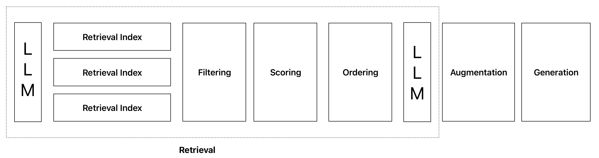
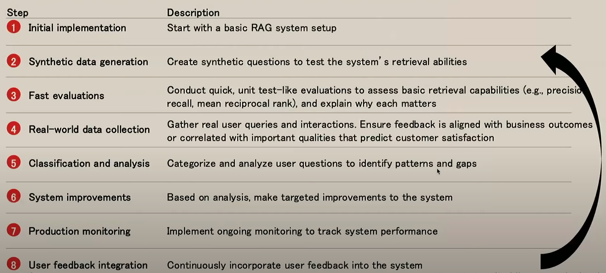

# How to Debug Your RAG Before It’s Too Late

## A Practical Framework to Identify Retrieval Failures

90% of RAG system failures stem from retrieval problems, not the LLM. After implementing this systematic diagnostic framework, teams can improve the retrieval performance of their RAG systems by up to 25% without replacing the current LLM.

If you're interested in how this can work for you, please visit my [consulting services page](../consulting.md) or reach out directly via [email](mailto:sudhandar@gmail.com).

## Why Your RAG System Is Only as Good as Its Retrieval

Your system can swap models or prompts endlessly, but if your retriever feeds garbage, your LLM will hallucinate with perfect confidence. The biggest RAG performance gains come from fixing retrieval issues, not model tuning.

Most organizations focus exclusively on the LLM's generation capabilities, completely ignoring the foundation that makes RAG systems work. While everyone debates which model is best, the real performance bottleneck remains unaddressed.

The reality is that RAG isn't just three simple steps (retrieve, augment, generate). Modern RAG systems involve multiple retrieval indexes, filtering mechanisms, scoring systems, and ordering processes all before the generation step even sees a token.

## What RAG Failures Sound Like (But What They Really Are)

After interacting with multiple teams implementing RAG systems, I consistently hear:

* "Our RAG system doesn't scale beyond a few hundred documents"
* "We keep tweaking prompts but quality doesn't improve"
* "We've swapped LLMs three times and still see hallucinations"
* "The LLM keeps citing the wrong source"

These symptoms all point to the same root cause: **retrieval failure**. Let's diagnose these problems systematically.

> *Diagram sourced from [improvingrag.com](https://www.improvingrag.com) — a great resource for teams looking to systematically improve their RAG systems.*

This systematic workflow is critical for RAG success because it transforms retrieval from a one-time implementation into a continuous improvement cycle. Each step builds on the previous one, creating a feedback loop that strengthens your system's capabilities over time. Without this structured approach, teams often get stuck in an endless cycle of model-swapping and prompt-tweaking without addressing the fundamental retrieval issues. 

Fixing retrieval doesn’t just reduce hallucinations, it accelerates deployment, increases stakeholder trust, and eliminates months of hidden iteration cycles.

## The RAG Retrieval Risk Framework (3 Types of Visibility You Need)

Use this **simple framework** to assess whether your team is catching the right retrieval issues *before they lead to hallucinations, customer complaints, or failed rollouts*.

### 1. Surface Visibility
*"Do we have clarity on what the system retrieved for a given query?"*

* Do you know what documents your system actually used to generate an answer?
* Can you see how that content connects to the response?
* If you can't trace an answer back to a source, you don't have surface visibility.

**Why it matters:** No traceability = No accountability. Even great model outputs can't be trusted without this.

### 2. Structural Visibility
*"Do we understand where our retrieval breaks down as the system scales?"*

* Is retrieval equally good at 1,000 docs vs. 100,000?
* Do you have any insight into how the system handles edge cases, ambiguity, or underrepresented queries?
* Are you overfitting to demo prompts instead of testing real-world messiness?

**Why it matters:** Most RAG systems fail **not during testing**, but when they hit production load or content complexity.

### 3. Performance Visibility
*"Can we quantify retrieval quality over time?"*

* Can you track performance for different user segments or use cases?
* Do you have metrics that signal when retrieval is silently degrading?
* Can you separate model issues from retrieval issues in production?

**Why it matters:** Without performance visibility, you'll waste weeks tweaking the wrong layer of the stack.

## When Retrieval Goes Wrong (And Everyone Blames the Model)

Here's a real example of how retrieval failure directly causes hallucination:

**User Query:** *"What is the penalty for dispensing a narcotic prescription without proper documentation in Ontario?"*

**Retriever Output:** Pulled documents about:

* General narcotic prescription handling
* Pharmacy refill processes
* Penalty clauses for **late refills** (unrelated)

**LLM Response:**
"The penalty is a 2-week suspension and a $500 fine."

**What's the problem?** That answer **sounds authoritative**, but it's **entirely fabricated.** The retriever never found a doc on regulatory penalties, so the LLM guessed based on context it didn't have.
**This is where trust breaks.**

Let's break down the pattern you'll see across many similar failures:

| What You See | What's Actually Happening |
|-------------|---------------------------|
| Model makes up numbers | No relevant data was retrieved, so it guesses |
| Output cites the wrong doc | Retriever returned a doc that *looked* relevant but wasn't |
| Same query gives different results each day | Retrieval logic is inconsistent or flaky |
| Engineers keep switching models, but results don't improve | Garbage in = garbage out. The model isn't the problem |

**Takeaway for leaders:** If you don't diagnose retrieval, you're just repackaging the same problem in a shinier LLM.

## Real-World Example:

Consider how Netflix approaches a similar problem with their recommendation system:

When users searched for "Oscar-nominated films" but got results for films starring actors named Oscar, Netflix realized they had a capability issue. Their inventory contained the correct films, but their retrieval mechanism couldn't connect the query intent to the right metadata.

The solution wasn't changing their recommendation algorithm but fixing their retrieval system to better understand award-related queries.

## How to Catch Problems Before and After Launch

Depending on where you are in your development cycle, you can identify retrieval problems in two ways:

### 1. Before Deployment: Proactive Testing

Before your system goes live, invest in creating proper test suites with diverse query types. Don't just test the "happy path" - challenge your system with ambiguous and edge case scenarios that reflect real-world usage.

### 2. After Deployment: Real-World Monitoring

Once your system is live, continually analyze user interactions and query patterns. Look for trends in where the system struggles and cases where users express disappointment or confusion with the answers.

## Decision-Maker Checklist: Are You Asking These Questions?

🔑 **Retrieval Leadership Checklist**

* **Can we audit what was retrieved for any user query?** *(If not, you lack surface visibility)*
* **Do we know how retrieval performance shifts as we scale?** *(If not, you're risking brittle systems in prod)*
* **Are we tracking retrieval-specific performance, not just model output?** *(If not, hallucinations will be misdiagnosed)*
* **Do we have someone responsible for evaluating and improving retrieval, not just prompt engineering?**
* **Are we investing in retrieval evaluation frameworks, not just LLM fine-tuning or switching vendors?**

Once you've identified your specific retrieval issues, the path to improvement becomes clear.

Quick win: Try auditing 10 real production queries today. Ask your team:

* What was retrieved?
* Was it relevant?
* Did it affect the answer?

You’ll be shocked how many “model” failures are actually retrieval failures in disguise.

## Ready to Diagnose Your RAG System?

If your RAG system is struggling despite having the latest LLM, chances are you're facing retrieval issues.

Want to learn how I can help improve your system's retrieval capabilities? Book a 60-minute diagnostic call, and I'll walk you through the most common retrieval failure patterns I see in your industry.

[Book Your Diagnostic Call →](https://cal.com/sudhandar/discoverycall)